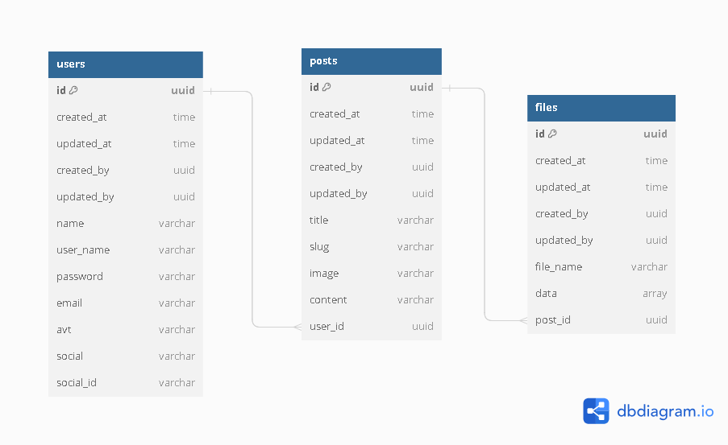

# Trail backend

## Tech stack

- [Golang](https://golang.org/): version 1.21
- [Echo](https://echo.labstack.com/): version 4
- [Gorm](https://gorm.io/): version 1.21
- [JWT](https://jwt.io/): version 3.21
- [PostgreSQL](https://www.postgresql.org/): version 16
- [Cloudinary](https://cloudinary.com/)

## Project structure

```
├── cmd
│   └── main.go # entry point
├── boostrap # dependencies injection modules
├── infra # config connecting to external services
├── config # config file
│   ├── app.env # environment variables
│   ├── config.yaml # config file
│   ├── config.go # load config file
├── domain
│   ├── dto # data transfer object
│   ├── entity # database entity
│   ├── ├──  # response.go # struct mapping model to response
│   ├── repo # repository interface
│   │  ├── model # struct mapping database table
│   ├── uploads # save file uploaded
├── pkg
│   ├── api_errors # error response
│   ├── lib # Set up external libraries.
│   ├── constants # constants
│   ├── utils # utils
├── presenter
│   ├── controller # To handle requests from clients and return responses
│   ├── middleware # Middleware to handle requests before reaching the controller
│   ├── request # Request struct
├── router # Router
├── usecase # business logic
├── docs # Swagger docs
├── migration # Database migrations
```
## Database


